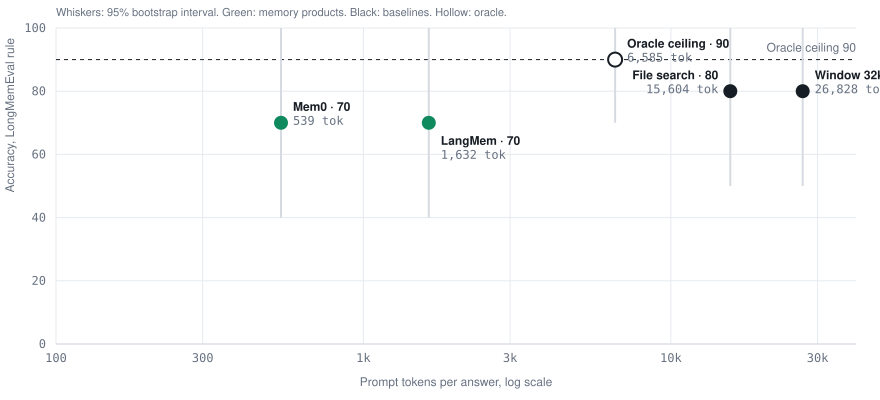
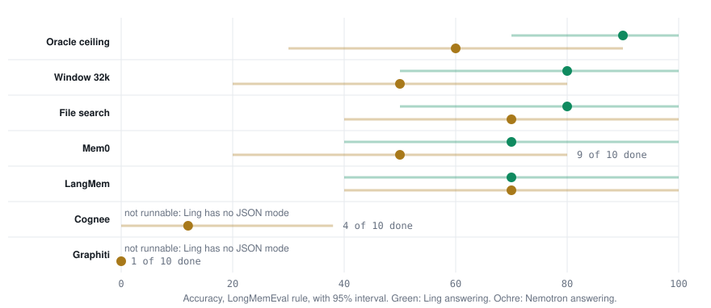
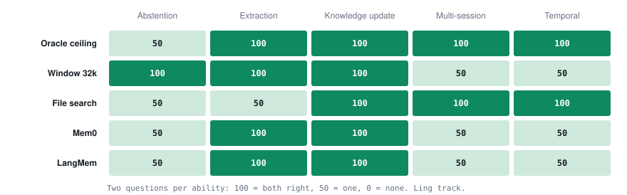
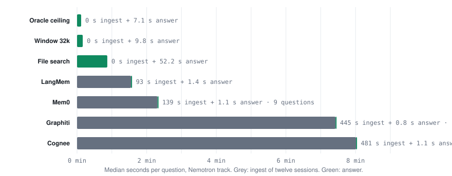

# Agent memory on a session clock: a pilot benchmark of memory products against context baselines on free models

Pilot run of 7 September 2026. Ten questions, one seed. This document follows
the structure of an empirical paper so that the method, the numbers, the
limitations and the next steps can be read and challenged separately.

## Abstract

We measure how well five agent memory systems (Mem0, LangMem, Cognee,
Graphiti, and, by configuration only, Letta) recall facts from a twelve-session
conversation history, against three baselines: an oracle that sees only the
evidence sessions, a 32k-token sliding window, and a file-search agent. Each
system ingests sessions one at a time in date order and is asked the question
only after the last session, so it can use only what it stored. We use ten
LongMemEval questions, two per ability, one seed, free models on OpenRouter,
and one judge applying three published grading rules. With Ling 3.0 Flash
answering, the oracle scores 90, the two baselines 80, Mem0 and LangMem 70;
the products spend 10 to 50 times fewer prompt tokens per answer. Switching
the answering model to Nemotron 3 Super moves the oracle to 60 with no change
to any memory system. Cognee and Graphiti cannot run under Ling, whose
endpoint refuses schema-constrained output, and are partial under Nemotron.
Of the two free models, Ling 3.0 Flash was the stronger answerer and the more
reliable endpoint on every system, but cannot run the graph products. Every
system scores 50 on abstention. Ingest, not answer latency, is where the
graph products spend their time: seven to eight minutes per question. We report
these as directions, not verdicts: every 95% interval overlaps every other.
The durable findings are methodological: name the answering model and print
the oracle, report several judge rules with a hand-checked sample, account for
ingest cost, and budget in requests per day.

## 1. Introduction

Memory products for agents publish accuracy numbers on long-conversation
benchmarks, usually against each other and rarely against the two cheapest
alternatives: putting the recent history in the context window, or letting the
model search a folder of transcripts. They also publish under different
answering models and different graders, so the numbers do not compose.

This pilot asks one question: on the same questions, with the same answering
model and the same judge, how do memory products compare to an oracle ceiling
and to plain baselines, in accuracy, tokens, and time? It also tests whether
that comparison can be run at zero cost on free models, which decides who can
reproduce it.

Contributions of the pilot:

1. A session-clock protocol and harness under which every system, product or
   baseline, receives the same sessions in the same order and answers with
   the same prompt.
2. First numbers for seven systems on ten questions under two answering
   models, with three judge rules and bootstrap intervals.
3. A catalogue of what breaks when products run on free endpoints, each with
   the fix now in the harness.

## 2. Background and prior evaluations

LongMemEval (Wu et al., 2024) is a benchmark of questions over long chat
histories with five ability labels: information extraction, multi-session
reasoning, temporal reasoning, knowledge updates, and abstention. LoCoMo
(Maharana et al., 2024) is a smaller set of very long two-person dialogues.
Zep reports Graphiti on both (Rasmussen et al., 2025); Mem0 reports on LoCoMo
(Chhikara et al., 2025); Letta maintains a leaderboard of its own. Each of
those reports used a paid frontier model as answerer and grader, and each
grades with its own rule. This pilot reuses LongMemEval's questions and its
per-type judge prompts verbatim, adds Zep's and Mem0's grading rules verbatim,
and adds the oracle and the two baselines that vendor reports omit.

## 3. Method

### 3.1 Task and data

Questions come from the cleaned 2025 release of LongMemEval S. From the full
set we select 100 questions, 20 per ability, with per-question seeds derived
from sha256 so the selection is reproducible across machines. For each
question the history is reduced to 12 sessions: every evidence session is
kept and distractor sessions are sampled from that question's own haystack,
preserving chronological order. The median reduced history is about 33,000
tokens and about 127 turns. The pilot uses the first ten questions of that
selection, two per ability; the selected set is committed as
`data/questions_s12.jsonl`.

### 3.2 Protocol: the session clock

For each (system, question, seed) unit the system is reset to an empty state
under a fresh namespace. Sessions are then presented one at a time in date
order, each as chat messages with the session date on the first turn. The
system never sees the whole history at once. After the last session the
question is asked with its own date given as today. Retrieval returns the
system's own context; the harness then produces the answer with one shared
prompt, temperature 0, seed 11, at most 512 output tokens. The prompt asks for
one or two short sentences and, when the context lacks the fact, the exact
sentence "The information is not available."

The oracle condition is the same protocol restricted to the evidence sessions.
It is a ceiling for this answerer and judge on this question set, not a
competitor.

### 3.3 Systems and configurations

| System | Kind | Configuration |
| --- | --- | --- |
| Oracle | ceiling | Evidence sessions only, 40k-token budget |
| Window | baseline | Last 32k tokens of the history |
| File search | baseline | One dated text file per session; the model may call `list_files`, `read_file`, `grep` at most 8 times, then must answer in prose |
| Mem0 | product | mem0ai 2.0.20, `Memory.add` per session, `Memory.search` top 10, local Qdrant, one unit at a time |
| LangMem | product | langmem 0.0.30, `MemoryStoreManager.invoke` per session, `search` top 10, in-memory store |
| Cognee | product | cognee 1.5.4, `add` then `cognify` per session, `search(GRAPH_COMPLETION, only_context)` top 10, sqlite, kuzu, lancedb, one unit at a time |
| Graphiti | product | graphiti-core 0.30.1, one episode per session with the session date as reference time, embedded FalkorDB, hybrid edge search top 10, BGE reranker, one unit at a time |
| Letta | product | letta-client 1.12.1 against the letta/letta Docker server; configured, not run. Letta has since deprecated that image and moved all agents to MemFS under its App Server and Agent SDK, so a future run goes through those, not this adapter |

The model inside each product is the track's answering model. Embeddings for
every product are `BAAI/bge-small-en-v1.5` (384 dimensions) on the CPU,
because no free API serves embeddings. Reasoning is turned off on every call
to every model, including the products' own calls, so the token and latency
columns compare memory work rather than hidden reasoning.

Two configuration choices depart from vendor reference setups and are stated
here. Graphiti ingests one episode per session rather than one per message:
per-message episodes would be about 127 episodes and on the order of 900
internal calls per question, which does not fit a free-tier budget. Cognee's
built-in rate limiter is set to 15 requests per minute.

### 3.4 Models and tracks

A track is one answering model applied to every system, including inside the
products, under the shared judge. Models were chosen by a responsiveness
probe of 13 free OpenRouter models (seven calls each, including a 4,000-token
prompt and a tool call). The pilot ran two tracks:

| Track | Answering model | Why | Systems it can carry |
| --- | --- | --- | --- |
| A | `inclusionai/ling-3.0-flash-fin:free` | fastest and most reliable free model in the probe, 0.7 s median | oracle, window, file, Mem0, LangMem |
| B | `nvidia/nemotron-3-super-120b-a12b:free` | the only responsive free model supporting tools, JSON object, JSON schema and seed | all seven |

Track A cannot carry Cognee or Graphiti because both request JSON through the
`response_format` field and Ling's provider rejects any such request.

### 3.5 Which model did what

Every number in this document was produced by one of four models. This
section names them and states, for each track and each system, which model
performed which step.

**Roster.**

| Model | Maker and shape | Context | Served through | Used as |
| --- | --- | ---: | --- | --- |
| Ling 3.0 Flash Fin (`inclusionai/ling-3.0-flash-fin:free`) | InclusionAI, mixture of experts, 124B total, 5.1B active | 262k | OpenRouter free tier (provider Novita) | answerer on track A; judge for every rule on both tracks; the model inside Mem0, LangMem and file search on track A |
| Nemotron 3 Super (`nvidia/nemotron-3-super-120b-a12b:free`) | NVIDIA, hybrid Mamba-Transformer mixture of experts, 120B total, 12B active, reasoning switched off by request flag | 262k | OpenRouter free tier (provider NVIDIA) | answerer on track B; the model inside all five products on track B; never a judge |
| bge-small-en-v1.5 (`BAAI/bge-small-en-v1.5`) | BAAI, 33M-parameter embedding model, 384 dimensions | | local CPU | embeddings for every product on both tracks |
| bge-reranker-v2-m3 (`BAAI/bge-reranker-v2-m3`) | BAAI, cross-encoder reranker | | local CPU | Graphiti's reranker at retrieval |

Cohere North Mini Code (`cohere/north-mini-code:free`, 30B total, 3B active)
was probed and configured as a third track but not run within the pilot's
budget. Models probed and not used: Gemma 4 31B and 26B (provider pool
saturated, every call refused), Nemotron 3.5 Lightning (71 s median per call),
Nemotron 3 Ultra 550B (42 s), Inkling and Inkling Small (requests refused),
LFM 2.5 2.6B (requests rejected), Nemotron 3 Nano Omni (a reasoning model)
and Nemotron 3.5 Content Safety (no tool calling).

**Roles by track.**

| Step | Track A | Track B |
| --- | --- | --- |
| Deciding tool calls in file search (`list_files`, `read_file`, `grep`, at most 8) | Ling 3.0 Flash | Nemotron 3 Super |
| Extraction and update decisions inside Mem0 and LangMem at ingest | Ling 3.0 Flash | Nemotron 3 Super |
| Entity, edge and summary extraction inside Cognee and Graphiti at ingest | not runnable | Nemotron 3 Super |
| Embedding stored items and queries in every product | bge-small-en-v1.5 | bge-small-en-v1.5 |
| Reranking retrieved edges in Graphiti | not runnable | bge-reranker-v2-m3 |
| Writing the final answer from the retrieved context, one shared prompt | Ling 3.0 Flash | Nemotron 3 Super |
| Grading under the LongMemEval, Zep and Mem0 rules, and the stale-answer check | Ling 3.0 Flash | Ling 3.0 Flash |

**Per system.** The answerer and the judge are the track's, as above; this
table lists what happens before the answer call.

| System | Model work at ingest | Embeddings | Reranker | Store | Model work at retrieval |
| --- | --- | --- | --- | --- | --- |
| Oracle | none; evidence sessions are placed in the prompt | none | none | none | none |
| Window 32k | none; the last 32k tokens are placed in the prompt | none | none | none | none |
| File search | none; sessions are written as dated text files | none | none | folder of files | the track model chooses up to 8 tool calls, then answers |
| Mem0 | the track model extracts memories and decides add, update or delete, through Mem0's LangChain provider | bge-small (LangChain HuggingFace) | none | local Qdrant, one collection per unit | vector search, top 10 |
| LangMem | the track model extracts and consolidates memories through LangChain | bge-small (LangChain HuggingFace) | none | LangGraph in-memory store, fresh per unit | vector search, top 10 |
| Cognee | the track model classifies, extracts a graph and writes summaries per chunk, through litellm with schema-constrained output | bge-small (fastembed) | none | sqlite, kuzu graph, lancedb vectors, one dataset per unit | graph completion context, top 10 |
| Graphiti | the track model extracts entities and edges per episode, resolves duplicates and writes node summaries, with schema-constrained output | bge-small (sentence-transformers) | bge-reranker-v2-m3 | embedded FalkorDB, one graph per unit | hybrid edge search, top 10, reranked |
| Letta | not run | | | | |

Two consequences follow. First, a product's score on a track is the product
plus the track model's skill at extraction; Mem0 on track B is Mem0 with
Nemotron inside, not Mem0 in general. Second, the judge on track A is the
answerer on track A, so any leniency the judge has toward its own phrasing
applies to every system on that track equally, and to none on track B.

### 3.6 Judging

One judge, `inclusionai/ling-3.0-flash-fin:free`, grades every answer on every
track, so differences between tracks come from the answerer. Each answer is
graded three times: under LongMemEval's per-type prompts taken verbatim from
its `evaluate_qa.py`, under Zep's "same topic" rule, and under Mem0's
partial-credit rule, the last two taken verbatim from the `verify.py` of
`ThinkfleetAI/memmesh-benchmarks`. The judge is told to reply with one word,
yes or no, with a 256-token limit; a verdict that contains neither is flagged
and counted. The judge never sees which system produced an answer. On track A
the judge grades its own answers, a known leniency risk that applies equally
to every system within the track. A blind hand check of 12 judged answers
after the pilot agreed with the judge 12 times out of 12.

### 3.7 Metrics and statistics

Accuracy is the share of questions judged correct under a rule. Intervals are
95% bootstrap intervals over questions (2,000 resamples, fixed seed). Prompt
tokens per answer are the provider's reported prompt token count for the
answer call, so they are measured, not estimated; a product's internal
extraction tokens are not observable from outside and are reported as ingest
seconds instead. Latency is wall-clock seconds for retrieval and for the
answer call, reported as medians and 95th percentiles. The forgetting curve
groups questions by the number of sessions between the last evidence session
and the question. The stale-answer rate is, among wrong answers to
knowledge-update questions, the share that gave the superseded value, as
judged by a fourth prompt.

Units that fail for reasons outside the system (an endpoint error after all
retries) are recorded with the error and counted as wrong in the track
summary until they are rerun; the tables below say where that applies.

### 3.8 Cost accounting and budget

Every run on both tracks cost 0 dollars. OpenRouter's free tier limits the
account to 20 requests per minute and to 1,000 requests per day across all
free models. The harness paces its own calls at one per 3.5 seconds and
retries rate-limit and upstream errors with backoff; the products' own calls
go through their libraries' clients and are additionally retried at the
session level. The whole pilot, including model probes, a full re-judge and
the partial track B, consumed one day's 1,000 requests.

### 3.9 Reproducibility

Every run record carries the answerer, judge, embedding model, seed, package
versions and, after a re-judge, the judge that produced the verdicts. Runs are
append-only JSON lines, resumable, and locked against concurrent writers.
`python -m membench.rejudge` re-grades an existing run without re-running the
systems. `scripts/charts.py` draws the figures below from the committed
summaries. Section 9 lists the commands.

## 4. Results

### 4.1 Accuracy and context, track A

| System | LongMemEval rule | 95% interval | Prompt tokens per answer | Answer p50 | Answer p95 |
| --- | ---: | ---: | ---: | ---: | ---: |
| Oracle ceiling | 90 | 70 to 100 | 6,585 | 6.5 s | 7.1 s |
| Window 32k | 80 | 50 to 100 | 26,828 | 7.5 s | 8.1 s |
| File search | 80 | 50 to 100 | 15,604 | 24.9 s | 48.6 s |
| Mem0 | 70 | 40 to 100 | 539 | 0.8 s | 2.8 s |
| LangMem | 70 | 40 to 100 | 1,632 | 1.2 s | 14.1 s |



Both products answer from about 2 to 6 percent of the tokens the window
baseline spends and land one question below the baselines. File search
matches the window on accuracy with 58 percent of its tokens, at three times
the answer latency because of the tool calls. No system reached the oracle.

### 4.2 Effect of the answering model

| System | Track A, Ling | Track B, Nemotron | Change |
| --- | ---: | ---: | ---: |
| Oracle ceiling | 90 | 60 | −30 |
| Window 32k | 80 | 50 | −30 |
| File search | 80 | 70 | −10 |
| Mem0 | 70 | 50 (56 over the 9 finished units) | −20 |
| LangMem | 70 | 70 | 0 |
| Cognee | not runnable | 25 over 4 finished units, 4 units failed | |
| Graphiti | not runnable | 0 over 1 finished unit | |



The oracle, which involves no memory system, moved by thirty points when the
answering model changed. No memory system moved a score by more than the
oracle did. Track B's answer latencies are also two to seven times higher,
which reflects the Nvidia endpoint rather than the systems.

### 4.3 Accuracy by ability, track A



Two questions per ability, so each cell is 0, 50 or 100. Every system except
the raw window scored 50 on abstention, and the window's 100 is the judge
accepting a long refusal. Temporal and multi-session questions separate the
baselines from the products by one question each.

### 4.4 Ingest and answer time, track B

| System | Median ingest seconds per question | Median answer seconds | Finished questions |
| --- | ---: | ---: | ---: |
| Oracle ceiling | 0 | 7.1 | 10 |
| Window 32k | 0 | 9.8 | 10 |
| File search | 0 | 52.2 | 10 |
| LangMem | 93 | 1.4 | 10 |
| Mem0 | 139 | 1.1 | 9 |
| Graphiti | 445 | 0.8 | 1 |
| Cognee | 481 | 1.1 | 4 |



Answer latency, the figure vendors publish, is under two seconds for every
product. Ingest is where the graph products spend their time: on the order of
a hundred model calls per question to turn twelve sessions into a graph. The
endpoint's own slowness and the retries it forced are included in these
medians.

### 4.5 Judge rules

| System | A, LongMemEval | A, Zep | A, Mem0 | B, LongMemEval | B, Zep | B, Mem0 |
| --- | ---: | ---: | ---: | ---: | ---: | ---: |
| Oracle ceiling | 90 | 90 | 90 | 60 | 60 | 70 |
| Window 32k | 80 | 80 | 80 | 50 | 50 | 70 |
| File search | 80 | 80 | 90 | 70 | 70 | 80 |
| Mem0 | 70 | 70 | 70 | 50 | 50 | 60 |
| LangMem | 70 | 70 | 70 | 70 | 70 | 70 |

The Mem0 partial-credit rule is the most lenient, by up to twenty points on
track B. The ranking of the top three changes between rules on both tracks,
so the track summaries mark the ranking as unstable.

### 4.6 Forgetting curve and stale answers

With ten questions the forgetting curve has one or two questions per distance
bin and is not interpretable; it is committed in the summaries and omitted
here. No system on either track gave a superseded value on a knowledge-update
question it got wrong: the stale-answer rate is zero everywhere.

### 4.7 Operational findings

Each of the following was found while running the pilot and is now handled in
the harness; each is a finding about running memory products on shared,
rate-limited endpoints rather than about their recall.

- Cognee and Graphiti require schema-constrained JSON output. Providers that
  do not offer it cannot run them at all.
- Nemotron reasons by default unless the request says otherwise: one small
  extraction call cost 7.5 seconds and 167 hidden tokens against 0.7 seconds
  with the flag. Graphiti's client has no hook for the flag, so it is wrapped.
- The Nvidia endpoint failed about one call in four with a fast 502 or a bare
  404, often carried inside an HTTP 200 body. None of the products retried
  all of these; the harness now retries at three layers.
- Cognee and Graphiti keep asyncio state bound to the loop that created it,
  so an adapter that opens a new loop per call fails on its second call.
- The judge's first configuration, a 64-token limit with no instruction to
  answer in one word, flipped five of twenty verdicts through truncation.
- The daily cap of 1,000 requests, not the per-minute cap, is the budget.

### 4.8 Which free model did best

The pilot was also a comparison of the free models themselves, on the same
questions, with the same judge. Ling 3.0 Flash Fin won or tied on every
system, was the faster endpoint, and never lost a unit to an endpoint error;
Nemotron 3 Super is the weaker answerer but the only free model that can run
every product.

| | Ling 3.0 Flash Fin | Nemotron 3 Super 120B |
| --- | ---: | ---: |
| Oracle ceiling | 90 | 60 |
| Window 32k | 80 | 50 |
| File search | 80 | 70 |
| Mem0 | 70 | 56 over the 9 finished units |
| LangMem | 70 | 70 |
| Mean over the five systems | 78 | 61 |
| Median latency in the probe, small calls | 0.7 s | 0.5 s |
| Oracle answer latency, p50 and p95 | 6.5 s, 7.1 s | 7.1 s, 29.4 s |
| Units lost to endpoint errors during the run | 0 of 50 | 14 of 50 in the first pass, before the retry layers |
| Calls failing in direct probes | none observed | about 1 in 4, fast 502 or bare 404, often inside a 200 body |
| Hidden reasoning | none | on by default, off by request flag |
| Schema-constrained JSON output | refused by the provider | supported |
| Systems it can carry | oracle, window, file, Mem0, LangMem | all seven |

The oracle row is the cleanest comparison, because no memory system is
involved: same evidence, same prompt, same judge, thirty points apart. The
gap narrows under the most lenient rule (Mem0 rule: 90 against 70) but does
not close.

Three caveats. The judge is Ling, so on its own track it grades its own
phrasing, and part of the gap may be leniency toward itself rather than
accuracy; a second judge is the first item in further study. Ten questions
give intervals that overlap. And the endpoint figures describe the free tier
on 7 September 2026, not the models: Nemotron's failures were the provider's,
and a paid or dedicated endpoint would not show them.

Two other candidates did not run. Cohere North Mini Code was configured as a
third track and stopped by the daily cap. Gemma 4 (31B and 26B) was the first
choice for a second track, but OpenRouter serves its free tier from a shared
provider pool that was saturated: every probe call and the first two attempted
units came back as rate-limited, so it was set aside; it also does not offer
schema-constrained output, so like Ling it could not carry Cognee or Graphiti.

### 4.9 Free answerer bake-off, 8 September 2026

After the pilot, every remaining free candidate on OpenRouter answered the
same ten oracle questions (evidence sessions only, seed 11) under the Ling
judge, and was probed once each for a plain reply, a JSON object, a JSON
schema and a tool call. About 330 calls in total; run records are in
`results/bakeoff/`.

| Model | Plain | JSON object | JSON schema | Tool call | Oracle correct | Errors | Answer p50 |
| --- | --- | --- | --- | --- | ---: | ---: | ---: |
| Ling 3.0 Flash Fin (pilot, track A) | ok | refused | refused | ok | 9 of 10 | 0 | 6.5 s |
| Ling 3.0 Flash Sante | ok | refused | refused | ok | 7 of 10 | 0 | 7.5 s |
| Dots 3 Note Preview | ok | ok | ok | ok | 4 of 9 | 1 | 7.6 s |
| Poolside Laguna S 2.1 | ok | ok | rate-limited | ok | 3 of 10 | 0 | 7.6 s |
| Cohere North Mini Code | ok | ok | ok | empty reply | 2 of 10 | 0 | 6.9 s |
| Gemma 4 31B and 26B | rate-limited on every call | | | | none finished | 10 each | |

No free model comes near Ling as an answerer. The only free model that
offers schema-constrained output, and so the only one able to carry Cognee
and Graphiti, scores half of Ling's ceiling. Gemma 4's shared pool was still
saturated a day later; every one of its calls was refused. The Ling rows are
graded by Ling itself, as on track A.

Consequence for the free route: the two graph products can run only under
Dots 3 Note Preview, a weak answerer, or under a paid model. A track under
Dots 3 is still a valid within-track comparison, since every system in it
shares the same answerer and the same oracle, but its ceiling would sit
around 45 and the absolute numbers would not be comparable with track A.

## 5. Discussion

On this sample the products do not recall better than the context window;
they recall almost as well at a small fraction of the context. That is a real
and useful property, and it is a different claim from the one vendor tables
make. The oracle result is the more important one for anyone reading vendor
numbers: the answering model moved the ceiling by thirty points, more than
any product moved any score, so numbers produced under different models are
not comparable and a table without an oracle row cannot be read.

Abstention is the one ability where every system fails equally. A memory
layer changes what the answerer sees, not its willingness to say it does not
know; the shared prompt asks for an exact refusal sentence, and the systems
produced it only half the time when it was correct to do so.

Among free models, the choice is a trade: Ling answers better and more
reliably, Nemotron is the one that can host every product. A track that
carries all seven systems under Ling is not possible until its provider
supports schema-constrained output.

The graph products' cost lands at ingest, and it is the cost that decides
whether they can be run at all on a given budget: they need about a hundred
calls per question and JSON-schema output, and on a free tier they advance
about ten questions a day.

## 6. Limitations

- **Sample size.** Ten questions, two per ability, one seed. Every 95%
  interval spans thirty to sixty points and every interval overlaps every
  other. Any ranking here can flip on one question.
- **Judge identity.** The judge is the answering model of track A, grading
  its own answers on that track. Leniency toward its own style is possible
  and cannot be separated from accuracy with one judge.
- **Judge sensitivity to phrasing.** The prompt asks for the exact sentence
  "The information is not available." when the context lacks the fact; the
  LongMemEval abstention rubric accepted a longer refusal and rejected that
  exact sentence at least once. Abstention scores are therefore noisier than
  the others.
- **Free endpoints.** Latency on shared free endpoints is the provider's, not
  the system's, and track B's endpoint was degraded during the run. Token
  counts are unaffected. Ingest medians for Cognee and Graphiti include
  retries forced by that degradation.
- **Partial products.** Cognee has four finished units and Graphiti one on
  track B; their rows are not comparable to the others and are shown only to
  document the state of the run. Letta was configured but not run.
- **Unobservable internal cost.** A product's own extraction and reranking
  tokens are not visible from outside; ingest seconds stand in for them.
- **Configuration departures.** Graphiti ingests one episode per session
  rather than one per message, and its reranker and every product's
  embeddings are small local models chosen for cost, not the vendors'
  defaults. Products were run with top-10 retrieval and otherwise defaults;
  no tuning was done for any system, baseline or product.
- **History reduction.** Each history is cut to twelve sessions with the
  evidence kept, so the task is easier than full LongMemEval S and harder
  than a short chat. Questions are asked only after the last session; the
  clock orders sessions but does not interleave questions.
- **Scope of models.** Two free models, one of them unable to run two of the
  products. Results under frontier models may differ in level and in order.
- **English only, one dataset.** No Datapace grounding set yet, no
  non-English histories, no human-written answers as a reference.
- **Reporting rule for failures.** Units that failed on the endpoint are
  counted as wrong in the committed track B summary until rerun; the tables
  above state the alternative figure over finished units where it matters.

## 7. Threats to validity

*Construct.* Accuracy under a model judge measures agreement with a rubric,
not human-perceived correctness; three rules and a hand check bound the
error but do not remove it. Tokens per answer measure the memory footprint
at answer time, not the system's total cost.

*Internal.* The same model answers, judges and extracts inside every product
on a track, which is the design's point, but it means a weakness of the
model, such as poor abstention, appears in every row at once and cannot be
attributed to any system. Endpoint degradation during track B affected
systems unequally: those with more internal calls suffered more retries and
more failures.

*External.* Free endpoints, a small embedding model, one seed, ten questions.
The direction of the findings (products cheaper, model moves the ceiling,
abstention unsolved, ingest dominates) is plausible beyond this setup; the
sizes are not.

## 8. Further study

1. **The full run.** 100 questions, 20 per ability, three seeds, all seven
   systems under one answering model, with intervals that separate a 70 from
   a 90. On the free tier this is about ten questions per day; on a second
   free provider or a few dollars of a small paid model it is a few days.
2. **A second judge and a human panel.** Repeat the grading with a judge that
   is not an answerer on any track, and label a 50-answer sample by hand to
   report judge agreement per rule.
3. **Answering-model tracks.** Add two or three more models so the oracle
   ceiling is reported as a range, and test whether product rankings are
   stable across answerers.
4. **Ingest cost accounting.** Count each product's internal calls and tokens
   by routing its client through a metering proxy, so ingest is reported in
   tokens and dollars, not seconds.
5. **Graphiti ingest granularity.** Run per-message episodes on a budget
   that allows it and measure what the coarser ingest costs in recall.
6. **Abstention prompts.** Test whether the exact-sentence refusal, a free
   refusal, or no instruction changes abstention scores and judge agreement.
7. **Interleaved questions.** Ask questions between sessions, so the clock
   also measures how soon a fact becomes retrievable and when an updated
   fact replaces the old one.
8. **A grounding set.** Add Datapace's own operational questions, where the
   evidence is structured metadata rather than chat, and compare the same
   systems.
9. **Letta and hosted services.** Run Letta through its App Server and Agent
   SDK, so the benchmark measures MemFS rather than the legacy blocks design,
   and, under a right of reply, the hosted versions of the products with the
   vendors' own defaults.
10. **Latency under load.** Measure on a dedicated endpoint so latency
    reflects the system rather than a shared free tier.

## 9. Reproducibility and data availability

The article this work supports, with the decision tree the findings feed, is
[Mem0 vs Zep vs Letta vs LangMem vs Cognee: which to pick](https://datapace.ai/blog/ai-agent-memory-tools-2026)
on datapace.ai.

Everything needed to reproduce the pilot is in this repository:

- `data/questions_s12.jsonl`: the selected questions and reduced histories.
- `configs/models.yaml`, `configs/tracks.yaml`, `configs/systems.yaml`: the
  models, tracks and system parameters used.
- `results/runs/track-*.jsonl`: every answer, context, token count, timing,
  judge verdict and provenance, one line per unit.
- `results/tracks/*/summary.{json,md}`: per-track summaries; track B is
  interim until Cognee and Graphiti finish.
- `results/charts/*.svg`: the figures, drawn by `scripts/charts.py`.
- `METHODS.md`: the full protocol and the dated log of what changed during
  the pilot and why.

To rerun a track with an OpenRouter key in `.env`:

```
scripts/run_tracks.sh --limit 10 --seeds 11 --workers 2
```

To regrade an existing run with the current judge:

```
python -m membench.rejudge --runs results/runs/track-ling-3.0-flash-fin.jsonl
```

## References

- Wu, D., Wang, H., Yu, W., Zhang, Y., Chang, K.-W., Yu, D. (2024). LongMemEval: Benchmarking chat assistants on long-term interactive memory. arXiv:2410.10813. Repository `xiaowu0162/LongMemEval`.
- Maharana, A., Lee, D.-H., Tulyakov, S., Bansal, M., Barbieri, F., Fang, Y. (2024). Evaluating very long-term conversational memory of LLM agents. arXiv:2402.17753.
- Rasmussen, P., Paliychuk, P., Beauvais, T., Ryan, J., Chalef, D. (2025). Zep: A temporal knowledge graph architecture for agent memory. arXiv:2501.13956. Repositories `getzep/graphiti`, `getzep/zep-papers`.
- Chhikara, P., Khant, D., Aryan, S., Singh, T., Yadav, D. (2025). Mem0: Building production-ready AI agents with scalable long-term memory. arXiv:2504.19413. Repositories `mem0ai/mem0`, `mem0ai/memory-benchmarks`.
- Cognee, `topoteretes/cognee`, version 1.5.4.
- LangMem, `langchain-ai/langmem`, version 0.0.30.
- Letta, `letta-ai/letta` and `letta-ai/letta-leaderboard`.
- Judge rules as reused: `ThinkfleetAI/memmesh-benchmarks`, `verify.py`.
- Adapter references: `RudrenduPaul/memtrust`.

## Appendix A. Judge hand check

After the re-judge with the one-word grader, 12 judged answers from track A
were sampled blind to the system and labelled by hand: 12 of 12 agreed with
the LongMemEval-rule verdict, including one abstention pair (a long refusal
accepted, a fabricated count rejected) and one answer that gave the correct
value and then appended the refusal sentence, which the judge accepted. The
earlier smoke sample (10 answers) also agreed 10 of 10. Before the grader fix,
5 of 20 hand-checked verdicts were wrong, all from truncation.

## Appendix B. Changes made during the pilot

The dated entries under "What we would do differently" in `METHODS.md` record
each change to the harness during the pilot, its cause and its effect on the
numbers: the judge fix and re-judge, Mem0 concurrency, tool-call markup on the
file baseline, structured outputs per track, hidden reasoning, Graphiti's
ingest unit, upstream errors inside 200 responses, event loops inside
products, and the daily cap.
